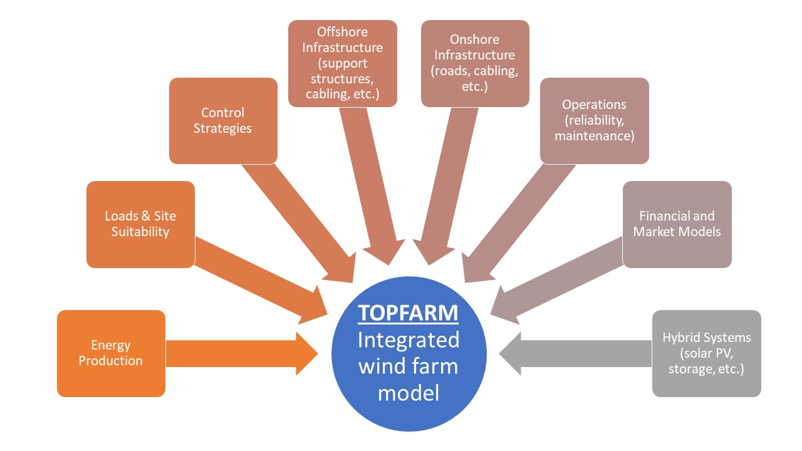

.. TOPFARM documentation master file.

Welcome to TOPFARM
===========================================

TOPFARM is a Python package developed by *DTU Wind Energy* that serves as a wind farm optimizer for both onshore and offshore wind farms. It uses the `OpenMDAO <http://openmdao.org/>`_ package for optimization and wraps the `PyWake <https://topfarm.pages.windenergy.dtu.dk/PyWake/>`_ package for easy computation of a wind farm’s Annual Energy Production (AEP).

In addition, it can compute other metrics such as the Internal Rate of Return (IRR) and Net Present Value (NPV) and utilizes different engineering wake models available in PyWake to perform the flow simulations.

What types of problems can TOPFARM solve?
-------------------------------------------

Over the years, TOPFARM has become a highly versatile tool that is capable of solving several types of optimization problems with different design variables and objectives functions in mind. Throughout its development, TOPFARM has evolved from simple layout optimization problems to more complex and relevant wind farm optimization scenarios. Its capabilities and range were designed for both research and industry related topics. Today, TOPFARM can provide the user solutions in:

    * Wind farm layout optimization for different turbine types
    * Wind farm layout optimization for different turbine hub heights
    * Active control (wake steering) optimization
    * Load constrained layout optimization
    * Load constrained wake steering optimization
    * Optimization with bathymetry
    * LCoE-based layout optimization
	
Additionally, the objective function in TOPFARM can be formulated in economical terms, that is with the inclusion of several financial factors that are inherent in the wind farm design process. These can include the financial balance, foundation costs, electrical costs (cabling), fatigue degradation of turbine components and Operation and Management (O&M) costs.

The calculations for the wind farm interactions are done through PyWake, which is responsible for computing the wake losses and power production of both individual turbines and whole wind farms with the use of `engineering wake models <https://topfarm.pages.windenergy.dtu.dk/PyWake/notebooks/EngineeringWindFarmModels.html>`_. In TOPFARM, the objective function is evaluated by the cost model component, and can be represented by either power production or financial goals.

TOPFARM comes with many built-in wake and cost models that were designed to accurately represent the optimization problem at hand. However, the tool is very flexible, and users are also able to perform custom optimizations as well.

For installation instructions, please see the :ref:`Installation Guide <installation>`. The base code is open-source and freely available on `GitLab 
<https://gitlab.windenergy.dtu.dk/TOPFARM/TopFarm2>`_ (MIT license).

Getting Started
^^^^^^^^^^^^^^^^^^^^^^^^^^^^^^^^^^^^^^^^^^^^

The configuration of a TOPFARM problem can increase in complexity depending on the case study at hand. For the basic tool capabilities, please refer to the :ref:`basic example <basic_examples>` section. The more elaborated wind farm optimization examples are shown in the :ref:`advanced examples <advanced_examples>` section. For new users, the :ref:`User Guide <user_guide>` provides detailed information about the components within TOPFARM and their description.

Can I get a private/commercial version of TOPFARM?
^^^^^^^^^^^^^^^^^^^^^^^^^^^^^^^^^^^^^^^^^^^^^^^^^^

For proprietary developers, we offer the option of having a short-term private
repository for co-development of cutting-edge plugins. Please contact the
`TOPFARM development team <mailto:dave@dtu.dk>`_ for further details.

How can I contribute to TOPFARM?
^^^^^^^^^^^^^^^^^^^^^^^^^^^^^^^^^^^^^^^^^^^^

We encourage contributions from different developers. You can contribute by
submitting an issue using TOPFARM's `Issue Tracker <https://gitlab.windenergy.dtu.dk/TOPFARM/TopFarm2/issues>`_
or by volunteering to resolve an issue already in the queue.

Citation
^^^^^^^^^^^^^^^^^^^^^^^^^^^^
If you are using TOPFARM, remember to cite it using:

Riccardo Riva, Jaime Yikon Liew, Mikkel Friis-Møller, Nikolay Krasimirov Dimitrov, Emre Barlas, Pierre-Elouan Réthoré, Mads Mølgaard Pedersen, “Welcome to TOPFARM .” URL = https://topfarm.pages.windenergy.dtu.dk/TopFarm2/index.html

Package Documentation
^^^^^^^^^^^^^^^^^^^^^^^^^^^^
    .. toctree::
        :maxdepth: 2

        installation
        user_guide
        basic_examples
	advanced_examples
        api
