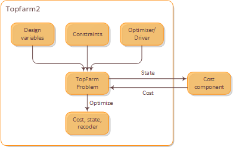

.. _user_guide:

User Guide
===========

As TOPFARM follows the OpenMDAO framework, its architecture is divided into components, which interact with each other to create the ``TopFarmProblem`` and subsequently work into finding the best possible solution to an optimization problem.

..

This user guide provides an overview of the important elements of an optimization within TOPFARM. For a detailed look into the available options or function inputs/outputs, please see the :ref:`api`. Examples of TOPFARM code via Jupyter notebooks can be found both in the :ref:`basic_examples` and :ref:`advanced_examples` section.

TopFarm Problem
----------------

The central object of TOPFARM’s workflow is the ``TopFarmProblem`` object. It is analogous to OpenMDAO’s ``Problem`` and requires the specification of several other objects such as: 
    
	* Design variables  
	* Cost component  
	* Optimization driver (optional)  
	* Constraints (optional)  
	* Plotting component (optional)  
	
Within the ``TopFarmProblem``, the ``optimize`` command is used to run the optimization (see :ref:`api`). Once finished, the optimization can return three items:
	
	* ``cost``: corresponds to the final result of the optimization.
	* ``state``: provides the final values of the design variables used in the optimization.
	* ``recorder``: presents a record of which sets of design variables were tried during the optimization.

Design Variables
-----------------

In TOPFARM, the design variables correspond to the variables that will be altered during the optimization which influence the objective function. By default, TOPFARM uses the turbine positions as design variables, but other types such as turbine types, turbine hub height and yaw angles can be used as well.
	

Cost Component
----------------

At its most simplest, the cost component is the object that calculates the objective function for the optimization (e.g., AEP). For nested optimizations, this cost component could actually be another TopFarmProblem. The cost component must be in the style of an OpenMDAO v2 ``ExplicitComponent``, but pure-Python cost functions can be wrapped using the ``CostModelComponent`` class in ``topfarm.cost_models.cost_model_wrappers``.

Other wrappers available are:

    * ``AEPCostModelComponent``: serves as a sub class from the ``CostModelComponent`` in which the objective function is the AEP by default.
    * ``AEPMaxLoadCostModelComponent``: another sub class from the ``CostModelComponent`` that it is used to incorporate fatigue loading into the objective function. It includes an option to constrain the loads to a maximum value as well to return the calculated fatigue loads.
    * ``PyWakeAEPCostModelComponent``: calculates the AEP as the objective function with the addition of a variety of engineering wake models.

For more information about these classes and their inputs, see the :ref:`api`.

DTU Cost Model
----------------	

For economic studies, DTU has developed an offshore cost model class, which includes methods for simple calculations of the Internal Rate of Return (IRR) and Net Present Value (NPV). Further, it breaks up the project costs into DEVEX, CAPEX, OPEX and ABEX within separate methods, which may be called individually. It generally relies on curve fitting using input parameters such as rated power or water depth and was tuned using data obtained from the industry. It supports three types of drivetrains: high-speed, medium-speed and direct-drive. It also supports two types of offshore foundations: monopile and jacket.
	
The model was originally created in Excel by Kenneth Thomse and Søren Oemann Lind and Rasmus (publication forthcoming). The monetary units are 2017 Euro. 

Drivers
----------

The optimization driver is used to perform the numerical optimization. In TOPFARM, several easy drivers are included that work out-of-the-box and can perform gradient-based and gradient-free optimizations. However, custom optimization drivers can also be coupled into a workflow.
	
The default driver is the ``EasyScipyOptimize`` driver, which uses ``scipy`` gradient-based SLSQP algorithm by default.  Other types of optimization drivers are also available, such as COBYLA, Genetic Algorithm (GA) and Random Search (RS) algorithms.

Constraints
-------------

The constraints are the limitations that are set upon the design variables. The most common constraints are spacing constraints between turbines or boundaries of the wind farm. Additional constraints can be specified with the ``post_constraint`` object within the ``TopFarmProblem`` class, for example load constraints. The provided constraints must be a list of the constraint components for the optimization. More details on the available constraint components in TOPFARM can be found in the :ref:`api`. There are no constraints by default.

Plotting Component
-------------------

The ``TopFarmProblem`` class allows the user to visualize the optimization with a plotting component. If enabled, it shows the state of the wind farm as it is being optimized including the current state of the objective function in each iteration.
